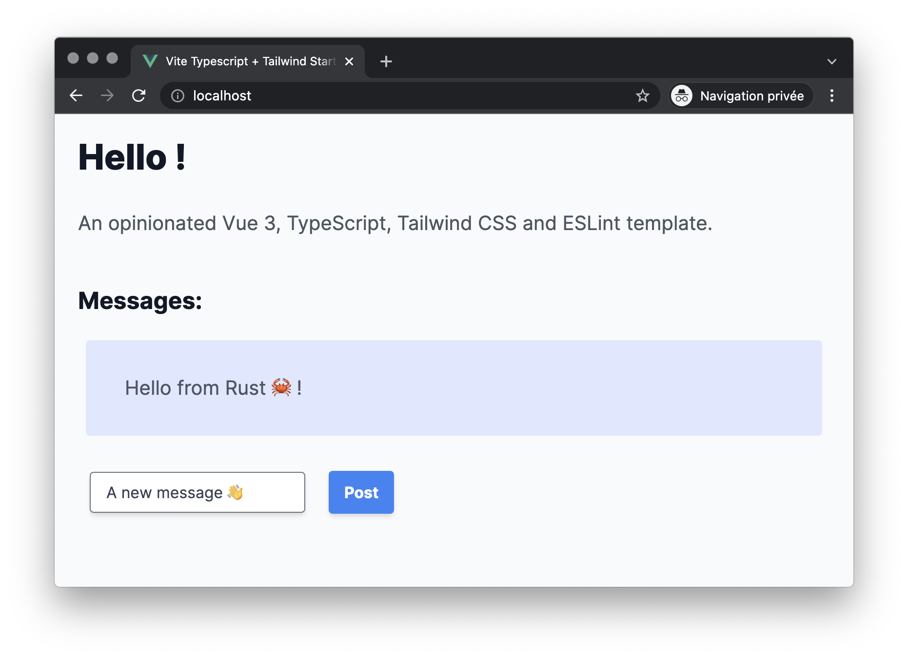

# Tutorial Axum + Vue + Tailwind 

This project is a short Week-End project I did to try:
  - The Rust web framework [axum](https://github.com/tokio-rs/axum)
  - The [Vite](https://vitejs.dev/) build tool
  - [Vue3](https://v3.vuejs.org/)
  - [Tailwind CSS](https://v1.tailwindcss.com/)

## How to use

To launch the project just use docker-compose with:

```
$ docker-compose up -d
```

## Preview



## Credits

  - Vincent Dörig for the [Vue 3, TypeScript & Tailwind CSS starter with vite](https://github.com/vincentdoerig/vue3-typescript-tailwind-starter)
  - [axum](https://github.com/tokio-rs/axum) creators
